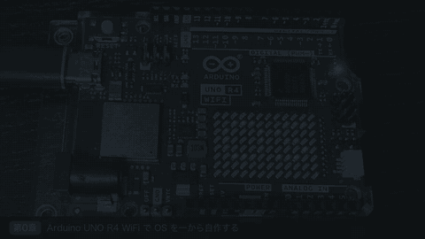
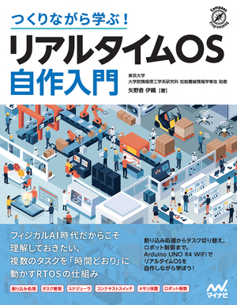
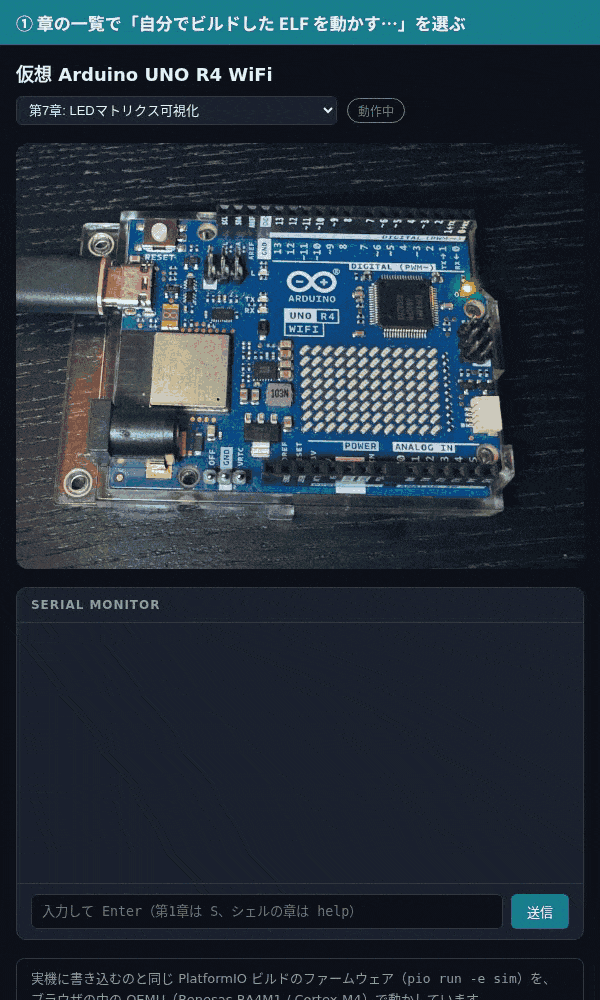
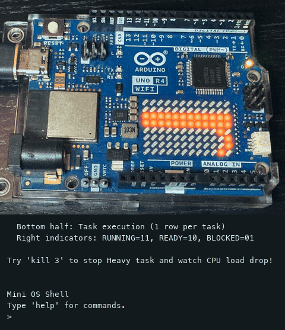

# build-your-own-arduino-rtos

書籍『**つくりながら学ぶ！リアルタイムOS自作入門**』（Arduino UNO R4
WiFi でプリエンプティブなリアルタイム OS を一から自作する本）の
サポートページです。

- サイト: https://iory.github.io/build-your-own-arduino-rtos/ （日本語）
  / [English](https://iory.github.io/build-your-own-arduino-rtos/en/)
- 内容: 開発環境のセットアップ、章ごとのサンプルコード案内、
  四脚ロボットの組み立て、FAQ・正誤表



## 書籍

<a href="https://book.mynavi.jp/ec/products/detail/id=152331"></a>

- 著者: 矢野倉伊織 ／ 出版社: マイナビ出版 ／ 発売日: 2026年9月18日
- ISBN: 978-4-8399-9187-6 ／ 書籍（紙）・電子版（PDF）
- 購入:
  [マイナビブックス](https://book.mynavi.jp/ec/products/detail/id=152331)
  ・[Amazon](https://www.amazon.co.jp/dp/4839991871)
  ・[楽天ブックス](https://books.rakuten.co.jp/rb/18716697/)
  ・[honto（電子書籍）](https://honto.jp/isbn/9784839991876)

<br clear="right">

## 実機がなくても試せる

Arduino UNO R4 WiFi が手元に無くても、実機に書き込むのと同じファームウェアを
エミュレータ（QEMU に UNO R4 を足した
[qemu-arduino-uno-r4](https://github.com/iory/qemu-arduino-uno-r4)）で動かして
本書を読み進められます。LED マトリクスと内蔵 LED は基板写真の上で光り、シェルも
そのまま使えます。

- **ブラウザで（インストール不要）** —
  [ブラウザ版](https://iory.github.io/build-your-own-arduino-rtos/sim/)を開くだけで各章が動きます。自分で書き換えてビルドした
  `firmware.elf` をドロップして動かすこともできます
  （[手順](https://iory.github.io/build-your-own-arduino-rtos/getting-started/simulator.html#browser-sim-elf)）。
  速さは実機の約 1/10 なので、重い計算を見せる章（第4章・第9章）は PC 版か実機で。
- **PC で（QEMU）** — `pio run -e sim` でビルドして仮想ボードを起動します。
  実機に近い速さで動き、全章の出力を CI で本文の期待値と照らしています
  （[付録「実機がなくても試せる」](https://iory.github.io/build-your-own-arduino-rtos/getting-started/simulator.html)）。

<table>
  <tr>
    <td width="50%" align="center" valign="top"></td>
    <td width="50%" align="center" valign="top"></td>
  </tr>
  <tr>
    <td align="center">ブラウザ版: 自分でビルドした ELF をドロップして動かす</td>
    <td align="center">PC 版（QEMU）: 第7章で <code>kill</code> すると CPU 負荷のグラフが下がる</td>
  </tr>
</table>

## 構成

XLeRobot のドキュメント（Sphinx + pydata-sphinx-theme + MyST +
sphinx-design）を参考に、言語ごとに独立したツリーを持つ:

```
docs/ja/source/   # 日本語（サイトのルートに配信）
docs/en/source/   # English（/en/ に配信）
docs/assembly/    # CAD から自動生成した組み立てビューア（静的バンドル、/assembly/ に配信）
docs/sim/         # ブラウザで動く仮想ボード（QEMU の WebAssembly 版、/sim/ に配信）
code/             # 書籍のサンプルコード（原稿リポジトリから自動同期。直接編集しない）
scripts/build.sh  # 両言語を _site/ にビルドし docs/assembly をコピー
scripts/build_sim.sh  # 各章を pio run -e sim でビルドし、QEMU の wasm と一緒に _site/sim/ に置く
scripts/record_sim_upload.sh  # 付録の「自分でビルドした ELF を動かす」GIF 2 枚を録る（生成物はコミットする）
scripts/make_brand_images.py  # ファビコンと OGP 画像を _static/ に生成（生成物はコミットする）
scripts/make_promo_video.py   # 紹介動画 promo.mp4（ja/en）と README 用 promo.gif を生成（同上）
scripts/md_lint.py            # Markdown の静かな崩れを検出・修正（CI の md-lint が実行）
```

`code/` は書籍の原稿側から一方向にミラーされる。誤植・バグ修正は原稿側で
行うので、ここで直しても次回の同期で上書きされる。

章のページは `literalinclude` で `code/` を直接読み込んでいるので、
コードが同期されるとサイトの表示も自動で最新になる（`docs` workflow は
`code/` の変更でも再ビルドする）。

言語切替はナビバーの Language ドロップダウン
（`BASE_URL` 環境変数でリンク先のベースパスを指定。
GitHub Pages では workflow が `/build-your-own-arduino-rtos/` を渡す）。

## ローカルビルド

```bash
uv sync
./scripts/build.sh
python3 -m http.server -d _site 8000   # http://localhost:8000/
```

main へ push すると GitHub Actions が GitHub Pages へ自動デプロイする
（リポジトリ設定の Pages で Source: GitHub Actions を選んでおくこと）。

## Markdown の検査

Sphinx は警告なしでビルドできても、Markdown が静かに崩れていることがある
（例: ```` ```{admonition} ```` の見出しにバッククォートを書くとフェンスに
ならず、その後ろのページ全体がコードブロックに飲み込まれる）。
`scripts/md_lint.py` がこれを検出し、意味を変えずに直せるものは直す。
PR では `md-lint` ワークフローが README と `docs/` を検査する。

```bash
uv run --script scripts/md_lint.py check README.md docs/ja/source docs/en/source
uv run --script scripts/md_lint.py fix   README.md docs/ja/source docs/en/source
```

`code/` は原稿リポジトリから同期されるので対象外。
`scripts/md_lint_hook.sh` は Claude Code の PostToolUse フック用で、書いた
`.md` をその場で直し、フェンスが壊れていれば止める。

## ライセンス

[Apache License 2.0](LICENSE)（Copyright 2026 Iori Yanokura）。

サンプルコード、四脚ロボットの CAD・STL・3MF・URDF、ファームウェア、
学習済み歩行ポリシーを含む。**商用利用可**で、キット化しての販売にも
事前の許諾・連絡・対価を要しない。独占的な取り扱いの取り決めも行わない。

商標はライセンスの対象外。「本書対応」のような事実の記載は自由だが、
「公式」「東京大学」「著者監修」等の表示は別途相談のこと。

`docs/assembly/` 配下の図と `docs/ja/source/` の文章は書籍の補助資料であり、
出版社から提供された誌面・図版は含まない。

例外として、次の図は Arduino の公式資料から引用しており、Apache-2.0 ではなく
[CC BY-SA 4.0](https://creativecommons.org/licenses/by-sa/4.0/) に従う
（出典は各ページの図の説明に記載）。

| ファイル（`docs/{ja,en}/source/_static/`） | 出典 | 改変 |
|---|---|---|
| `uno_r4_wifi_pinout.png` | [ABX00087 Full Pinout](https://docs.arduino.cc/resources/pinouts/ABX00087-full-pinout.pdf) 1 ページ目 | 凡例を除いて切り抜き |
| `uno_r4_wifi_block_diagram.png` | [ABX00087 Datasheet](https://docs.arduino.cc/resources/datasheets/ABX00087-datasheet.pdf) 3 Block Diagram | 縮小のみ |
| `uno_r4_wifi_led_matrix_schematic.png` | [ABX00087 Schematics](https://docs.arduino.cc/resources/schematics/ABX00087-schematics.pdf) 2 ページ目 | PNG 化のみ |
| `uno_r4_minima_vs_wifi.png` | docs.arduino.cc の製品画像 [UNO R4 Minima](https://github.com/arduino/docs-content/blob/dab66ecbd6ad52cd742da6c19c5b6330a7f2caae/content/hardware/uno/boards/uno-r4-minima/image.svg) / [UNO R4 WiFi](https://github.com/arduino/docs-content/blob/dab66ecbd6ad52cd742da6c19c5b6330a7f2caae/content/hardware/uno/boards/uno-r4-wifi/image.svg)（[arduino/docs-content](https://github.com/arduino/docs-content)） | 2 枚を並べ、製品名を付けて PNG 化 |

ライセンスの根拠: 各 PDF 内の CC BY-SA 4.0 表記、および
[arduino/docs-content の LICENSE](https://github.com/arduino/docs-content/blob/main/LICENSE.md)。

書籍の表紙画像 `docs/{ja,en}/source/_static/book_cover.jpg`（README からも
参照）は © マイナビ出版で、Apache-2.0・CC BY-SA 4.0 のどちらの対象でもない
（出典: [マイナビブックスの書籍ページ](https://book.mynavi.jp/ec/products/detail/id=152331)
の書影、無改変）。これを縮小して貼り込んだ OGP 画像 `og_image.png` の表紙部分も
同様。紹介動画 `promo.mp4` と `promo.gif` も、冒頭の OGP 画像と末尾の
エンドカードに表紙を含むので、その部分は同様（実写・図・端末録画の部分は
Apache-2.0）。ファビコン（`favicon.svg` など）は第0章のスケッチの表示から生成したもので、
Apache-2.0 に従う。
