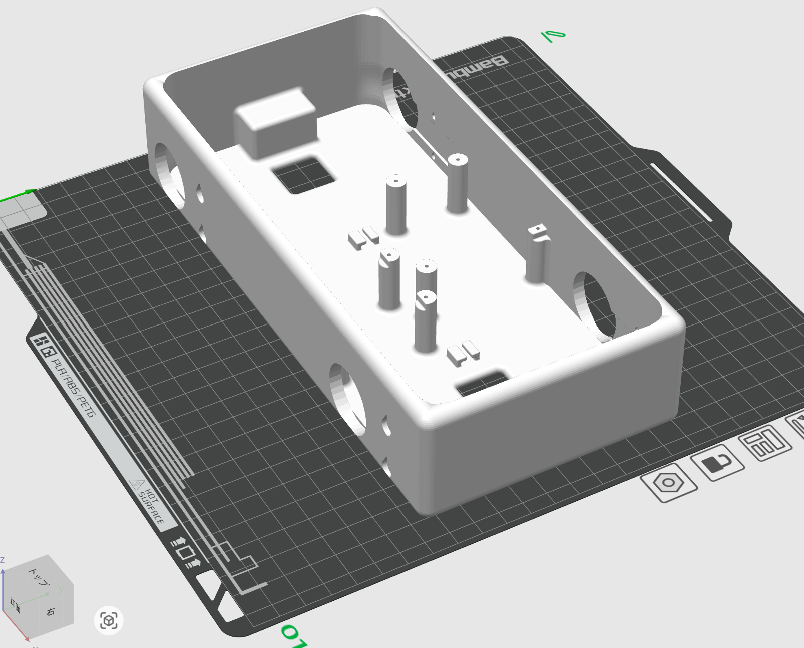
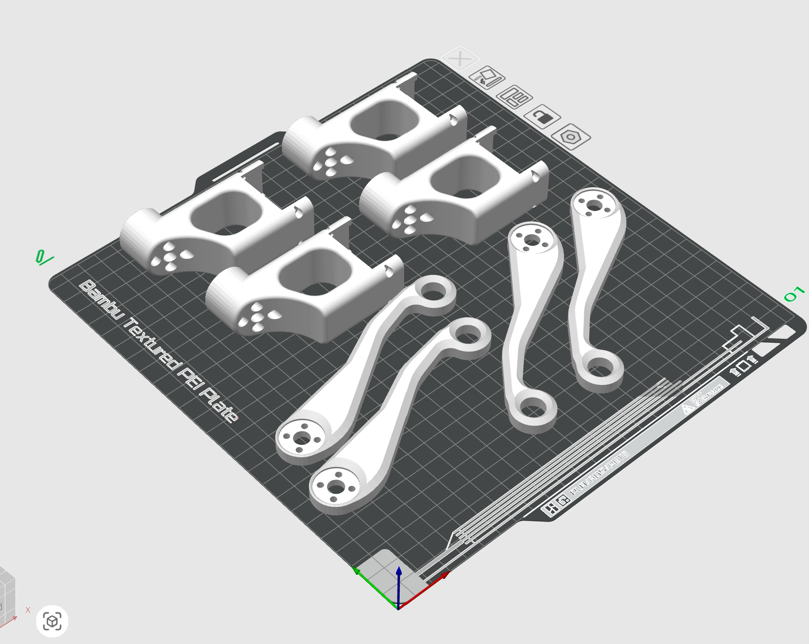

# Bill of materials (BOM) — 8-DoF quadruped

What you need to build the chapter 13 robot. **This is the same configuration as the
book's robot**; prices are as of August 2026. The shops listed are in Japan (prices
in yen, tax included); outside Japan, look for the same parts by model number.

```{contents} On this page
:local:
:depth: 2
```

---

## Electronics

| # | Item | Shop code | Unit price | Qty | Subtotal |
|---|---|---|---|---|---|
| 1 | [FEETECH serial bus servo STS3215 12V 30kg·cm](https://akizukidenshi.com/catalog/g/g130969/) | Akizuki 130969 | ¥3,580 | 8 | **¥28,640** |
| 2 | [Serial bus servo driver board (Waveshare 25514)](https://akizukidenshi.com/catalog/g/g131227/) | Akizuki 131227 | ¥1,280 | 1 | ¥1,280 |
| 3 | [Switching AC adapter 12V 5A AD-A120P500](https://akizukidenshi.com/catalog/g/g110663/) | Akizuki 110663 | ¥2,380 | 1 | ¥2,380 |
| 4 | [Breadboard jumper wires (male–female) 15 cm](https://akizukidenshi.com/catalog/g/g108932/) | Akizuki 108932 etc. | ¥280 | 1 | ¥280 |
| 5 | USB Type-C cable (must support data): [C-to-C — CIO SL30000-CC](https://www.amazon.co.jp/dp/B0B2PQ5N71) / [A-to-C — CIO SL30000-AC](https://www.amazon.co.jp/dp/B09LC5T7YL) | — | from ¥1,500 | 1 | ¥1,500 |
| 6 | [ROBOTIS 3P Extension PCB](https://e-shop.robotis.co.jp/product.php?id=96) (bus splitter, optional) | 903-0142-000 | ¥495 | 2 | ¥990 |

You need **only one of the two cables**: C-to-C if your computer has a Type-C port,
**A-to-C if it only has Type-A**.

**Total about ¥35,100.** The servos are 81% of it.

The screws for assembly (M3×6 ×40, M2×6 ×16) **come with the STS3215 servos**, so you
do not need to buy them.

You also need an **Arduino UNO R4 WiFi** and, for walking, a **12 V battery (about a 3S
LiPo)**.

### AC adapter capacity

From the datasheet's **stall torque 2.942 N·m / 2.7 A**, assuming current is roughly
proportional to torque, we estimated **0.92 A/(N·m)**.

| State | Torque per joint | Total for 8 |
|---|---|---|
| Holding the standing pose (measured 0.27 N·m) | 9% | about 2 A |
| Walking (rms 0.75 N·m, fastest gait) | 76% | about 5.5 A |
| All 8 stalled at once | 100% | 21.6 A |

**We chose 5 A.** Bench work (calibration, identification, holding a pose) needs about
2 A, and walking fits on average. The peaks at each footstep exceed 5 A, so **adding
one electrolytic capacitor (2200–4700 µF / 25 V) across the terminal block** reduces
servo resets caused by the voltage sagging.

There is no point in buying a 21.6 A supply: every joint stalls at once only in an
accident.

**Use a battery when walking on the floor.** A quadruped dragging a 1 m DC cable is
dangerous, and the cable has actually come out. The AC adapter is for the bench.

The driver board's input limit is **12.6 V**. A fully charged 3S LiPo is exactly
12.6 V, right at the limit.

### Battery power (optional)

To walk on the floor you need a battery. **Taking 12 V from a USB-C PD power bank is
the easiest way, and it works on the real robot.**

| # | Item | Requirement |
|---|---|---|
| a | USB-C PD power bank | **Its output PDOs must list `12V ⎓ 3A`** |
| b | USB Type-C to C cable (short) | Supports data. A normal 60 W cable is fine for 3 A |
| c | [PD trigger cable PDC-12VE](https://www.sengoku.co.jp/mod/sgk_cart/detail.php?code=EEHD-5X3J) | **Fixed 12 V**, 5 A, DC 5.5/2.1, **centre positive**, ¥1,830 |

No soldering or crimping: plug power bank → C-to-C cable → trigger cable → the
board's DC jack.

**Choose by requirement, not by product name.** Power banks change quickly and the
models below will disappear within a few years. There is only one test: **does the
product page list `12V` among its output specs?** "PD 65W" or "up to 100W" alone does
not tell you.

```{admonition} 12 V is optional in USB PD
:class: warning
USB PD's fixed voltages are basically 5 V / 9 V / 15 V / 20 V; **12 V is optional**, and
plenty of products do not have it. **Anker does not offer 12 V on its USB-C outputs**
(checked in the official specs: the Nano Power Bank 10K 45W has 5V/9V/**10V**/15V/20V,
and 12 V is only available on the USB-A port's QC modes).

Products with only PPS (variable, e.g. 3.3–11 V) **cannot deliver 12 V to an ordinary
fixed-12 V trigger cable** either.

And **15 V and 20 V exceed the board's 12.6 V limit.** If you use a switchable trigger
cable, do not set it to 15 V by mistake; a fixed one is safer.
```

**For reference, products whose official specs confirm 12 V / 3 A** (as of August
2026; examples only):

| Product | Capacity | Weight | 12 V |
|---|---|---|---|
| [CIO SMARTCOBY TRIO 67W](https://connectinternationalone.co.jp/cioproduct/mobilebattery/smartcoby/cio-mb67w2c1a-20000/) | 20000 mAh | about 333 g | 3 A |
| [CIO SMARTCOBY Pro PLUGⅡ 67W3C](https://connectinternationalone.co.jp/cioproduct/mobilebattery/smartcoby/cio-mb67w3c-10k-p2/) | 5000 mAh | about 308 g | 3 A |
| [ELECOM DE-C81L-10000](https://www.elecom.co.jp/products/DE-C81L-10000BK.html) | 10000 mAh | **about 220 g** | 3 A |

**Light models that do have 12 V stop at 1.6–2.5 A.** We could not find a 12 V / 3 A
model in the 100 g class: 12 V / 3 A needs a 45 W-class unit or bigger, and its
circuitry and cells cannot get below 200 g.

**Always check the polarity.** PD trigger cables with **centre negative** are sold for
guitar effects pedals and look identical; plugging one in reverses the polarity
instantly.

12 V / 3 A = 36 W leaves no margin, so **add one electrolytic capacitor (2200–4700 µF /
25 V)** to absorb inrush current. If it still drops out, move up to a 67 W class unit.

### Things to know before wiring

**This board's UART is wired RX to RX and TX to TX** (the board's RX to the Arduino's
RX, TX to TX). Note that this is not the usual crossed RX/TX UART wiring (stated on
[Waveshare's product page](https://www.waveshare.com/bus-servo-adapter-a.htm)).

The board has a **USB Type-C port and an A/B jumper** to switch between "driven from
the PC over USB" and "driven from the Arduino over UART". Bring-up and calibration are
quicker over USB, so **it is worth setting up both**.

Three jumper wires between the Arduino and the board (the board's UART header ↔
D0/D1/GND) are enough. If one comes out while walking the robot falls over, so for a
firmer connection make your own with 2.54 mm pin headers and sockets.

```{figure} ../_static/quadruped_driver_board.jpg
:target: ../_static/quadruped_driver_board.jpg
:width: 50%
:alt: The driver board. The yellow part is the A/B jumper; USB Type-C and the DC jack are at the bottom right

The driver board. The yellow part is the A/B jumper; USB Type-C and the DC jack are at the bottom right
```

### Splitting the bus (optional)

Servos can be **daisy-chained** (each servo has two 3-pin connectors), so a hub is not
required. But the quadruped's legs come out at four corners, so a splitter board keeps
the cables short and makes routing easier.

FEETECH's connector is the **Molex Mini-SPOX 5264** (2.50 mm pitch, 1 = GND / 2 = Vcc /
3 = signal), **the same as Dynamixel's Molex line (AX / MX)**, so ROBOTIS's splitter
boards work as they are.

| Product | Part no. | Connector | Price (tax incl.) | For this robot |
|---|---|---|---|---|
| [3P Extension PCB](https://e-shop.robotis.co.jp/product.php?id=96) | 903-0142-000 | **Molex 3P** (header 22-03-5035) | **¥495** | **This one. 6 ports, M2 screw holes** |
| [3P JST Expansion Board](https://e-shop.robotis.co.jp/product.php?id=506) | 903-0306-000 | JST 3P | ¥1,584 | Different family |
| [4P JST Expansion Board](https://e-shop.robotis.co.jp/product.php?id=505) | 903-0307-000 | JST 4P | ¥1,716 | For RS-485 |

**Do not mix up the Molex and JST versions.** ROBOTIS itself says the Molex version is
"not compatible with the X series, which uses JST connectors" and the JST version "not
compatible with the AX / MX, which use Molex connectors". FEETECH is on the Molex side.

The header `22-03-5035` is from the Mini-SPOX 5267 series, the proper mating part for
the 5264 housing. **However, we have not confirmed an actual case of a FEETECH cable
plugged into the ROBOTIS board.** At ¥495, the quickest way is to buy one and check.

**Buy two and split them between the left and right legs.** The Mini-SPOX 5264 is rated
**3.0 A** per contact, and the total while walking is about 5.5 A (table above), so all
8 servos through one hub exceeds the rating. Split left and right, each carries 4
servos, about 2.7 A.

**The back of the board is not insulated.** Mounting it on the plastic body is fine, but
do not put it on metal (ROBOTIS's warning).

Akizuki Denshi and Switch Science do not carry an equivalent splitter board (as far as
we searched, they only have bare connectors and housings, or I²C / USB hubs).

---

## 3D-printed parts

Download the STLs below (in millimetres; exported from the same CAD data as the 3D
viewer in [Assembly](assembly.md)).

| Part | File | Size [mm] | Qty | Volume |
|---|---|---|---|---|
| Body | `body.stl` | **230.0 × 110.0 × 50.0** | 1 | 243.6 cm³ |
| Leg bracket | `bracket_outline.stl` | 127.9 × 52.2 × 12.0 | 4 | 19.1 cm³ |
| Leg link | `leg_link1.stl` | 80.0 × 52.0 × 26.0 | 4 | 39.2 cm³ |

::::{grid} 3
:gutter: 2

:::{grid-item}

```{button-link} ../../assembly/quadruped/stl/body.stl
:color: primary
:expand:
body.stl (×1)
```

:::
:::{grid-item}

```{button-link} ../../assembly/quadruped/stl/bracket_outline.stl
:color: primary
:expand:
bracket_outline.stl (×4)
```

:::
:::{grid-item}

```{button-link} ../../assembly/quadruped/stl/leg_link1.stl
:color: primary
:expand:
leg_link1.stl (×4)
```

:::
::::

### Sliced projects (for Bambu Studio)

Project files with the same settings and layout as the book's robot was printed with
(Bambu Lab X1C, 0.4 nozzle, 0.28 mm, **ABS**, automatic tree supports, Textured PEI
plate). To print in PLA, just change the filament.

::::{grid} 2
:gutter: 2

:::{grid-item}

```{button-link} ../../assembly/quadruped/stl/body.3mf
:color: secondary
:expand:
body.3mf (body plate)
```


:::
:::{grid-item}

```{button-link} ../../assembly/quadruped/stl/leg_parts.3mf
:color: secondary
:expand:
leg_parts.3mf (plate with the 8 leg parts)
```


:::
::::

**9 parts, about 477 cm³ in total.**

```{figure} ../_static/quadruped_parts.jpg
:target: ../_static/quadruped_parts.jpg
:width: 50%

The 9 printed parts and 8 STS3215 servos
```

**The left and right legs use the same parts.** Print each bracket and link STL four
times; there are no separate left and right versions.

---

## Printing them yourself

| | |
|---|---|
| Material | **PLA is enough.** PETG or ABS also work (ABS warps easily, so use a printer with an enclosure) |
| Bed | **At least 230 mm on one side.** The body is 230 mm long |
| Filament | **About 240 g** (estimate; slicing gives the exact figure) |
| Cost | **About ¥700** (roughly a quarter of a 1 kg spool of PLA at ¥2,500–3,500) |

The body is 230 mm, so **check the bed size before you buy a printer.**

| Printer | Bed | Body |
|---|---|---|
| Bambu X1C / P1S | 256 × 256 | Fits |
| Prusa MK4 | 250 × 210 | Fits |
| Bambu A1 mini | 180 × 180 | Does not fit |

Plan on one job for the body and one for the 4 brackets + 4 links. The bracket is a
12 mm plate, so print it flat (it takes the servo's torque, and printing flat puts the
layers in-plane, which is also the right choice for strength).

**PLA's default slicer profile (0.20 mm layers) is enough.** To make parts stronger,
**adding walls** (2 → 4–6) helps more than raising the infill.

---

## Ordering prints

For when you have no printer, the bed is smaller than 230 mm, or you want the
toughness of nylon.

| Service | Process | Typical price | For 477 cm³ |
|---|---|---|---|
| [PCBWay Shared Projects](https://www.pcbway.com/project/shareproject/?category=3D+Printing) | FDM / SLA / MJF and more | Cheap because FDM is available | Quote needed |
| [DMM.make 3D print](https://make.dmm.com/print/) | MJF PA12 | from ¥113/cm³ | **from about ¥54,000** |
| DMM.make | SLS PP | from ¥63/cm³ | from about ¥30,000 |

**Ordering prints costs more than the servos.** Printing yourself costs ¥700, a
**77×** difference. A printer that can print 230 mm costs ¥40,000–90,000, so **one order
costs about as much as a printer.**

And you will always rebuild a robot's frame: a leg breaks, you move a hole, you change
a mounting angle. Designing on the assumption that every rebuild costs ¥54,000 is not
realistic. **Printing yourself is the main route; ordering is the exception.**

---

## The mass differs from the simulation model

The mass of printed parts varies a lot with material and infill (477 cm³ printed solid
in PLA is about 590 g; at 20% infill, about 240 g). It will always differ from the
simulation model, so if you want to compare with the simulation, **weigh the parts you
made and correct the model's masses**. Inertia and the centre of mass change too.

---

## License

The **STL, 3MF, CAD, URDF, firmware and trained walking policy** distributed on this page
are under the [Apache License 2.0](https://github.com/iory/build-your-own-arduino-rtos/blob/main/LICENSE).

- **Commercial use is allowed.** You may sell them as a kit, with no prior permission
  or notice required.
- Neither the author nor the University of Tokyo will ask for license or royalty fees.
- We will not ask for exclusive arrangements either. Anyone can build it and anyone can
  sell it.
- You may modify and redistribute them. Follow the Apache-2.0 terms (keep the copyright
  notice and LICENSE, and state your changes).

Trademarks are not covered by the license. **Stating facts** such as "for this book" or
"SO-101 compatible" is fine, but please ask first before using labels such as
"official", "University of Tokyo" or "supervised by the author".

```{admonition} To businesses selling kits
:class: tip
Once you start selling, let us know through an
[Issue](https://github.com/iory/build-your-own-arduino-rtos/issues) or by e-mail and we
will list you in a "buy a kit" section on this page. Listing is free, with no listing or
referral fees. Kits confirmed to work on the real robot will be marked as such.
```

---

## Sources

- Akizuki Denshi product pages (linked above)
- [Bus Servo Adapter (A) — Waveshare](https://www.waveshare.com/bus-servo-adapter-a.htm) (RX-RX / TX-TX, 9–12.6 V)
- [3P Extension PCB — ROBOTIS Japan e-shop](https://e-shop.robotis.co.jp/product.php?id=96) (price, stock, M2, header 22-03-5035, uninsulated back)
- [USB interface / hub boards — ROBOTIS Japan e-shop](https://e-shop.robotis.co.jp/list.php?c_id=117) (comparison of 4 hub boards)
- [How to Use STS3215 — Cirkit Designer](https://docs.cirkitdesigner.com/component/ff940def-9432-4e1a-bede-b65e49fd0ea7/sts3215) (5264-3P, 1 = GND / 2 = Vcc / 3 = signal)
- [Molex Mini-SPOX (5264) Connector Guide — Keszoox](https://keszoox.com/blogs/news/molex-mini-spox-connector-guide) (3.0 A / 2.50 mm / friction lock)
- [PKT shop PDC-12VE — Sengoku Densho](https://www.sengoku.co.jp/mod/sgk_cart/detail.php?code=EEHD-5X3J) (fixed 12 V, 5 A, centre positive)
- [Anker Nano Power Bank (10K, 45W)](https://www.anker.com/products/a1638-10k-45w-power-bank) (confirms no 12 V in the USB-C PDOs)
- PDOs of the CIO / ELECOM power banks: each official product page (linked above)
- [DMM.make 3D print](https://make.dmm.com/print/) (price per cm³ by material, build size)
- Dimensions and volumes measured from the distributed STLs
